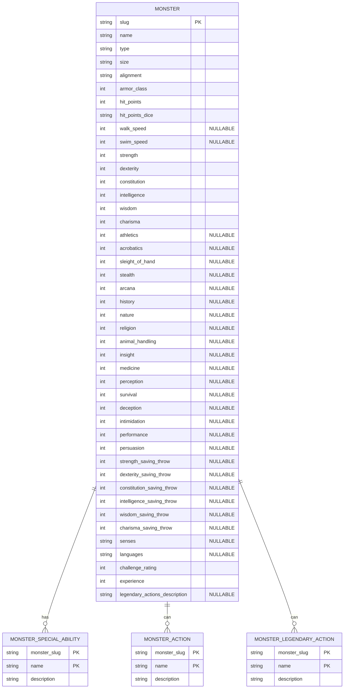

# Roleparty

## Database

```mermaid
erDiagram
    MONSTER {
        string slug PK
        string name
        string type
        string size
        string alignment
        int armor_class
        int hit_points
        string hit_points_dice
        int walk_speed "NULLABLE"
        int swim_speed "NULLABLE"
        int strength
        int dexterity
        int constitution
        int intelligence
        int wisdom
        int charisma
        int athletics "NULLABLE"
        int acrobatics "NULLABLE"
        int sleight_of_hand "NULLABLE"
        int stealth "NULLABLE"
        int arcana "NULLABLE"
        int history "NULLABLE"
        int nature "NULLABLE"
        int religion "NULLABLE"
        int animal_handling "NULLABLE"
        int insight "NULLABLE"
        int medicine "NULLABLE"
        int perception "NULLABLE"
        int survival "NULLABLE"
        int deception "NULLABLE"
        int intimidation "NULLABLE"
        int performance "NULLABLE"
        int persuasion "NULLABLE"
        int strength_saving_throw "NULLABLE"
        int dexterity_saving_throw "NULLABLE"
        int constitution_saving_throw "NULLABLE"
        int intelligence_saving_throw "NULLABLE"
        int wisdom_saving_throw "NULLABLE"
        int charisma_saving_throw "NULLABLE"
        string senses "NULLABLE"
        string languages "NULLABLE"
        int challenge_rating
        int experience
        string legendary_actions_description "NULLABLE"
    }

    MONSTER_SPECIAL_ABILITY {
        string monster_slug PK
        string name PK
        string description
    }

    MONSTER ||--}o MONSTER_SPECIAL_ABILITY : has

    MONSTER_ACTION {
        string monster_slug PK
        string name PK
        string description
    }

    MONSTER ||--}o MONSTER_ACTION : can

    MONSTER_LEGENDARY_ACTION {
        string monster_slug PK
        string name PK
        string description
    }

    MONSTER ||--}o MONSTER_LEGENDARY_ACTION : can
```